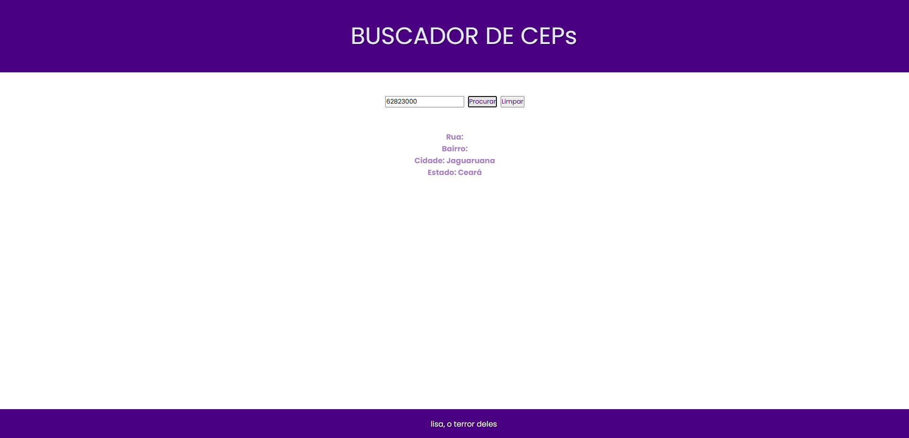

# Projeto buscador de CEP´s

O objetivo do projeto é pesquisar CEPs em uma API chamada https://viacep.com.br/.

## Design do projeto



## API utilizada

A API utilizada https://viacep.com.br/ retorna um json contendo as seguintes informações para um cep de exemplo 62823000: 

```
//https://viacep.com.br/ws/62823000/json/

{
  "cep": "62823-000",
  "logradouro": "",
  "complemento": "",
  "unidade": "",
  "bairro": "",
  "localidade": "Jaguaruana",
  "uf": "CE",
  "estado": "Ceará",
  "regiao": "Nordeste",
  "ibge": "2307007",
  "gia": "",
  "ddd": "88",
  "siafi": "1441"
}
```
## Funcionalidades

- [x] Busca do CEP
- [x] Limpar dados
- [ ] Melhorado o design
- [ ] Responsividade
- [ ] Rodapé
 
 ### Observações: 

 > [!NOTE]
 > Projeto feito na disciplina de Programação WEB I do curso de ADS do IFCE de Jaguaruana.

 > [!IMPORTANT]
 > Alguns CEPs podem não ter todas as informações.

## Contatos

Email: laisccastroc2023@gmail.com

